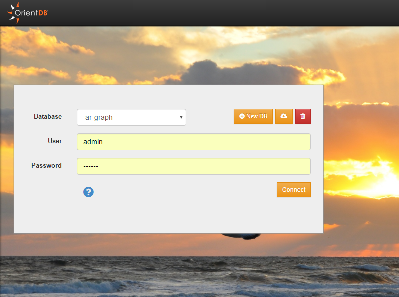
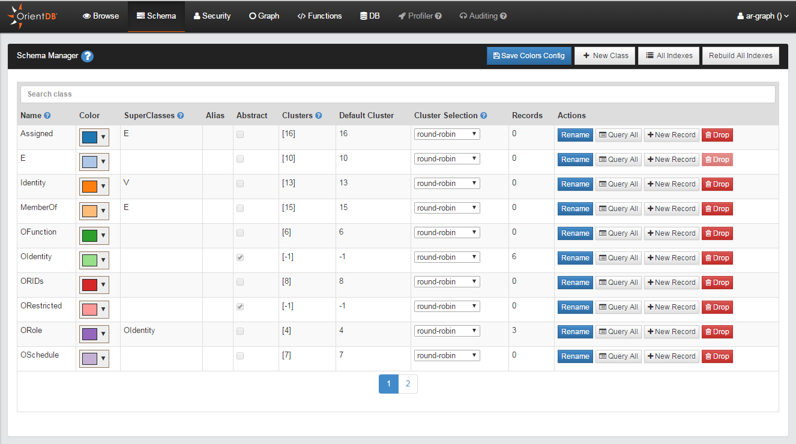
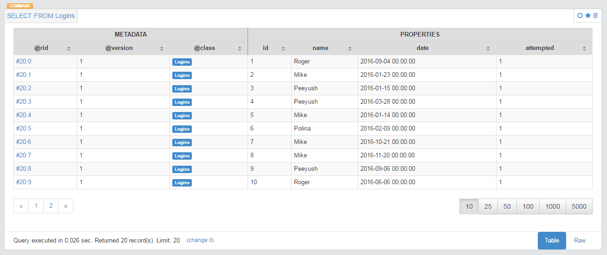

# OrientDB with Docker on Windows 7

This example shows how to start OrientDB Studio in a Docker container on Windows 7.

### Usage

Pull the latest image from DockerHub.

```bash
$ docker pull orientdb/orientdb
```

In order to persist the OrientDB configuration and data, use a Docker `Data Volume`. Instead of typing all this from the command line, use a `docker-compose` configuration file instead.

```yaml
# docker-compose up -d

orientdb:
  container_name: orientdb
  image: orientdb/orientdb
  ports:
    - "2424:2424"
    - "2480:2480"
  volumes:
    - ./data/orientdb/config:/orientdb/config
    - ./data/orientdb/databases:/orientdb/databases
  environment:
     ORIENTDB_ROOT_PASSWORD: changeme
```

Invoke `docker-compose` as follows:

```bash
$ docker-compose up -d
```

The `-d` switch puts it in daemon mode, where you may attach to it later; see below.

### Connect to OrientDB Studio

On Windows, the URL is http://192.168.99.100:2480/. Whereas on Mac OS X or Linux, it is http://localhost:2480/. Upon entering the link into your browser, you are met with a login screen.



Navigate to the schema tab.




### Bulk Insert

A bulk insertion of records may be conducted with the `oetl` extract, transform, and load (`ETL`) tool, which is used from the OrientDB console. To use the console, we must attach to the Docker OrientDB container.

#### Windows

Now get the ID and attach to the docker container.

```bash
$ docker-machine ssh
$ dm ssh
                        ##         .
                  ## ## ##        ==
               ## ## ## ## ##    ===
           /"""""""""""""""""\___/ ===
      ~~~ {~~ ~~~~ ~~~ ~~~~ ~~~ ~ /  ===- ~~~
           \______ o           __/
             \    \         __/
              \____\_______/
 _                 _   ____     _            _
| |__   ___   ___ | |_|___ \ __| | ___   ___| | _____ _ __
| '_ \ / _ \ / _ \| __| __) / _` |/ _ \ / __| |/ / _ \ '__|
| |_) | (_) | (_) | |_ / __/ (_| | (_) | (__|   <  __/ |
|_.__/ \___/ \___/ \__|_____\__,_|\___/ \___|_|\_\___|_|
Boot2Docker version 1.10.2, build master : 611be10 - Mon Feb 22 22:47:06 UTC 2016
Docker version 1.10.2, build c3959b1

docker@default:~$ docker ps -a
CONTAINER ID        IMAGE               COMMAND             CREATED             STATUS              PORTS
                             NAMES
32adfbf6eb62        orientdb/orientdb   "server.sh"         About an hour ago   Up About an hour    0.0.0.0:2424->2424/t
cp, 0.0.0.0:2480->2480/tcp   orientdb
docker@default:~$ docker exec -i -t 32adfbf6eb62 /bin/bash
```

More detail here: [How to get bash or ssh into a running container in background mode?](http://askubuntu.com/a/507009).

Use the `ETL` procedure from the OrientDB documentation: http://orientdb.com/docs/2.0/orientdb-etl.wiki/Import-from-CSV-to-a-Graph.html. Create a JSON file that describes what is imported, e.g.

```json
{
  "source": { "file": { "path": "/orientdb/config/logins.csv" } },
  "extractor": { "row": {} },
  "transformers": [
    { "csv": {} },
    { "vertex": { "class": "Logins" } }
  ],
  "loader": {
    "orientdb": {
       "dbURL": "remote:/localhost/my-graph",
       "dbType": "graph",
       "dbUser": "root",
       "dbPassword": "changeme",
       "classes": [
         {"name": "Logins", "extends": "V"}
       ], "indexes": [
         {"class":"Logins", "fields":["id:integer"], "type":"UNIQUE" }
       ]
    }
  }
}
```

Navigate to `/orientdb/bin` and invoke the `ETL` script.

```bash
# bin/oetl.sh /orientdb/config/logins_etl.json
 
+ extracted 44,775 rows (5,796 rows/sec) - 44,775 rows -> loaded 44,773 vertices (5,796 vertices/sec) Total time: 14007m
s [0 warnings, 0 errors]
END ETL PROCESSOR
+ extracted 50,001 rows (5,839 rows/sec) - 50,001 rows -> loaded 50,000 vertices (5,840 vertices/sec) Total time: 14902m
s [0 warnings, 0 errors]
```

To detach use the following escape sequence: `CTRL + p CTRL + q`. For more detail see [How do you attach and detach from Docker's process?](http://stackoverflow.com/a/19689048/6146580).

When the import process completes, we are able to access the new records.



## References
